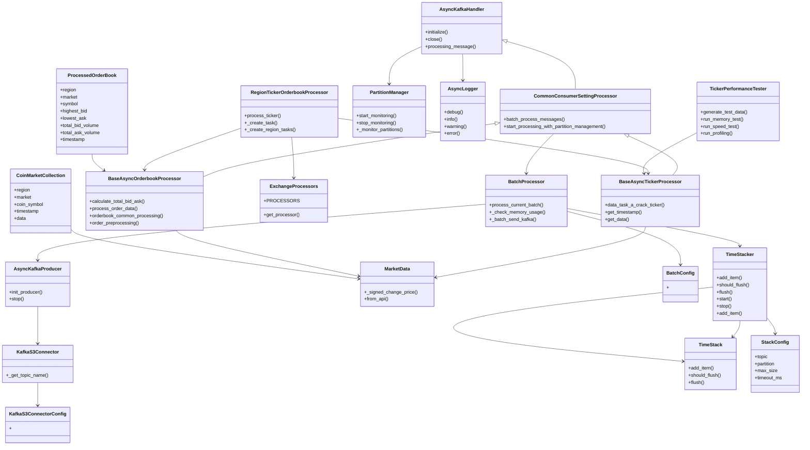

# MarketFirstPreprocessHub

`MarketFirstPreprocessHub`는 카프카 토픽에서 수집한 데이터를 1차 전처리하는 클래스입니다. 이 클래스는 
두 가지 주요 카테고리로 나뉘며, 각각 **Ticker**와 **Orderbook**으로 구성되어 있습니다.

## 시스템 아키텍처 


## 📊 클래스 구조


## 📈 Ticker
- **목적**: 다양한 거래소에서 제공하는 가격 정보를 실시간으로 수집하고 가공하여, 효율적으로 데이터 분석 및 거래 결정을 지원합니다.
- **지원 지역 및 거래소**:
    - **한국**: 
        - 업비트
        - 빗썸
        - 코빗
        - 코인원
    - **아시아**: 
        - OKX
        - Bybit
        - Gateio
    - **유럽 및 미국**: 
        - 바이낸스
        - 크라켄

## 📊 Orderbook
- **목적**: 각 거래소의 주문서 데이터를 실시간으로 수집하고, 이를 분석하여 시장의 유동성과 심리를 파악하는 데 도움을 줍니다. 이 정보를 통해 사용자들은 더 나은 거래 전략을 수립할 수 있습니다.
- **지원 지역 및 거래소**:
    - **한국**: 
        - 업비트
        - 빗썸
        - 코빗
        - 코인원
    - **아시아**: 
        - OKX
        - Bybit
        - Gateio
    - **유럽 및 미국**: 
        - 바이낸스
        - 크라켄

## Group-id
- 각 partition 별 지정된 파티션으로 수동 조작
- **ticker**:
    - `Ticker_group_id_Asia`
    - `Ticker_group_id_Korea`
    - `Ticker_group_id_NE`
- **Orderbook**:
    - `Orderbook_group_id_Asia`
    - `Orderbook_group_id_Korea`
    - `Orderbook_group_id_NE`

## 소모하는 토픽
- **Ticker**:
    - `asiaSocketDataIn-ticker` (partition=3개)
    - `koraSocketDataIn-ticker` (partition=4개)
    - `neSocketDataIn-ticker`(partition=2개)
- **Orderbook**:
    - `asiaSocketDataIn-Orderbook` (partition=3개)
    - `koraSocketDataIn-Orderbook` (partition=4개)
    - `neSocketDataIn-Orderbook`(partition=2개)

## 📥 전처리하고 난 후 보내는 토픽
- **Ticker**:
    - `Region.Asia_TickerPreprocessing` (partition=3개)
    - `Region.Korea_TickerPreprocessing` (partition=4개)
    - `Region.NE_TickerPreprocessing`(partition=2개)
  
- **Orderbook**:
    - `Region.Asia_OrderbookPreprocessing` (partition=3개)
    - `Region.Korea_OrderbookPreprocessing` (partition=4개)
    - `Region.NE_OrderbookPreprocessing` (partition=2개)

## 🚀 Kafka Connector
- 이 시스템은 Kafka Connector를 통해 데이터를 MinIO로 전송합니다.
- 전송 조건:
    - Ticker 전처리 토픽 데이터: 20개 수집 후 전송
    - Orderbook 전처리 토픽 데이터: 50개 수집 후 전송

## 📊 데이터 포맷
- **Orderbook**:
```json 
{
  "region": "Asia",
  "market": "OKX",
  "coin_symbol": "BTC",
  "highest_bid": 66609.22,
  "lowest_ask": 66619.98,
  "spread": 10.759999999994761,
  "total_bid_volume": 0.0016,
  "total_ask_volume": 0.259115,
  "timestamp": "2024-10-23 10:25:00.050791+00:00"
}
```

- **Ticker**:
```json
{
  "region": "Asia",
  "market": "OKX",
  "coin_symbol": "BTC",
  "timestamp": 1729678813578.0,
  "data": [
    {
      "opening_price": "67006.4",
      "trade_price": "66199.8",
      "max_price": "66568.8",
      "min_price": "67838.0",
      "prev_closing_price": "66568.8",
      "acc_trade_volume_24h": "7828.8",
      "signed_change_price": "0.8",
      "signed_change_rate": "0.000000"
    }
  ]
}
```
🚀 기능

	•	데이터 수집: 카프카를 통해 각 거래소에서 실시간으로 데이터를 수집합니다.
	•	데이터 정제: 수집한 데이터를 분석하기 용이한 형태로 변환하고, 불필요한 정보를 제거합니다.
	•	에러 처리: 데이터 수집 및 처리 과정에서 발생할 수 있는 다양한 오류를 효과적으로 처리하여 시스템의 안정성을 높입니다.


### 🚀 사용 방법

```pyhon3
poetry shell 

python main.py
```


# 전체 파일구조 
```
├── 📄 README.md                 # 프로젝트 설명 문서
├── 📁 logs                      # 로그 파일 저장 디렉토리
├── 🐍 main.py                   # 프로그램 진입점, 웹소켓 클라이언트 초기화
├── 📦 mq                        # 메시지 큐 관련 모듈
│   ├── 🐍 dlt_producer.py       # Dead Letter Topic 프로듀서
│   ├── ⚠️ exception             # 예외 처리 모듈
│   │   ├── __init__.py
│   │   └── 🐍 m_exception.py    # 사용자 정의 예외 클래스
│   ├── 🛠️ kafka_config.py       # Kafka 설정 관리
│   ├── 🐍 m_comsumer.py         # Kafka 컨슈머 구현
│   ├── 🐍 m_producer.py         # Kafka 프로듀서 구현
│   └── 🐍 partition_manager.py   # Kafka 파티션 모니터링
├── 🐍 order_ticker.py           # 주문서/티커 처리 메인 클래스
├── 📦 poetry.lock               # Poetry 의존성 잠금 파일
├── 📄 pyproject.toml            # Poetry 프로젝트 설정
├── 📜 requirements.txt          # 프로젝트 의존성 목록
├── 🐍 run_tests.py              # 테스트 실행 스크립트
├── ⚙️ setting                   # 설정 관리
│   ├── 🛠️ ticker.yml            # 티커 처리 설정
│   └── 🛠️ yml_load.py           # YAML 설정 로드
├── 🐍 sink_connector.py         # Kafka to S3 커넥터
├── 📁 src                       # 소스 코드
│   ├── 📁 common                # 공통 모듈
│   │   ├── 📁 admin             # 관리 기능
│   │   │   ├── 🐍 batch_processor.py  # 배치 처리 관리
│   │   │   ├── 📁 logging       # 로깅 관련
│   │   │   │   ├── 🐍 logger.py        # 비동기 로거
│   │   │   │   └── 🐍 logging_text.py  # 로그 메시지 포맷
│   │   │   └── 🐍 time_stracker.py     # 시간 기반 데이터 스태킹
│   │   ├── 🐍 common_consumer.py  # 공통 컨슈머 설정
│   │   ├── 🐍 common_orderbook.py # 공통 주문서 처리
│   │   └── 🐍 common_ticker.py    # 공통 티커 처리
│   ├── 🛠️ config.py             # 애플리케이션 설정
│   ├── 📖 orderbook             # 주문서 처리
│   │   ├── 🐍 asia_orderbook.py  # 아시아 거래소
│   │   ├── 🐍 korea_orderbook.py # 한국 거래소
│   │   └── 🐍 ne_orderbook.py    # NE 거래소
│   └── 📊 ticker                # 티커 처리
│       ├── 🐍 korea_ticker.py    # 한국 거래소
│       └── 🐍 ne_asia_ticker.py  # NE/아시아 거래소
├── 📁 tests                     # 테스트
│   ├── 🐍 performance_test.py   # 성능 테스트
│   └── 🐍 run_performance_tests.py # 테스트 실행
└── 📁 type_model               # 데이터 모델
    ├── __init__.py
    ├── 🐍 config_model.py      # 설정 모델
    ├── 🐍 kafka_model.py       # Kafka 관련 모델
    ├── 🐍 orderbook_model.py   # 주문서 데이터 모델
    └── 🐍 ticker_model.py      # 티커 데이터 모델
```


