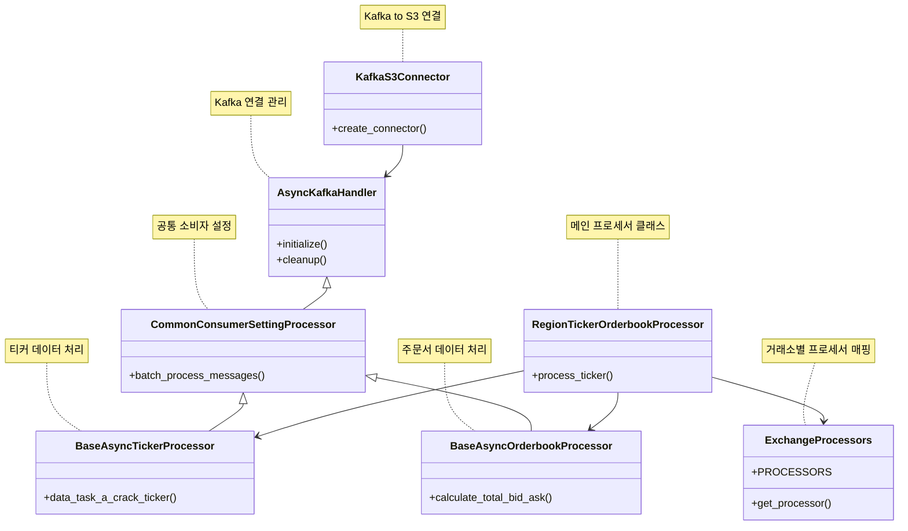

# MarketFirstPreprocessHub

`MarketFirstPreprocessHub`는 카프카 토픽에서 수집한 데이터를 1차 전처리하는 클래스입니다. 이 클래스는 
두 가지 주요 카테고리로 나뉘며, 각각 **Ticker**와 **Orderbook**으로 구성되어 있습니다.

## 시스템 아키텍처 


## 📊 클래스 구조


## 📈 Ticker
- **목적**: 다양한 거래소에서 제공하는 가격 정보를 실시간으로 수집하고 가공하여, 효율적으로 데이터 분석 및 거래 결정을 지원합니다.
- **지원 지역 및 거래소**:
    - **한국**: 
        - 업비트
        - 빗썸
        - 코빗
        - 코인원
    - **아시아**: 
        - OKX
        - Bybit
        - Gateio
    - **유럽 및 미국**: 
        - 바이낸스
        - 크라켄

## 📊 Orderbook
- **목적**: 각 거래소의 주문서 데이터를 실시간으로 수집하고, 이를 분석하여 시장의 유동성과 심리를 파악하는 데 도움을 줍니다. 이 정보를 통해 사용자들은 더 나은 거래 전략을 수립할 수 있습니다.
- **지원 지역 및 거래소**:
    - **한국**: 
        - 업비트
        - 빗썸
        - 코빗
        - 코인원
    - **아시아**: 
        - OKX
        - Bybit
        - Gateio
    - **유럽 및 미국**: 
        - 바이낸스
        - 크라켄

## Group-id
- 각 partition 별 지정된 파티션으로 수동 조작
- **ticker**:
    - `Ticker_group_id_Asia`
    - `Ticker_group_id_Korea`
    - `Ticker_group_id_NE`
- **Orderbook**:
    - `Orderbook_group_id_Asia`
    - `Orderbook_group_id_Korea`
    - `Orderbook_group_id_NE`

## 소모하는 토픽
- **Ticker**:
    - `asiaSocketDataInBTC-ticker` (partition=3개)
    - `koraSocketDataInBTC-ticker` (partition=4개)
    - `neSocketDataInBTC-ticker`(partition=2개)
- **Orderbook**:
    - `asiaSocketDataInBTC-Orderbook` (partition=3개)
    - `koraSocketDataInBTC-Orderbook` (partition=4개)
    - `neSocketDataInBTC-Orderbook`(partition=2개)

## 📥 전처리하고 난 후 보내는 토픽
- **Ticker**:
    - `Region.Asia_TickerPreprocessing` (partition=3개)
    - `Region.Korea_TickerPreprocessing` (partition=4개)
    - `Region.NE_TickerPreprocessing`(partition=2개)
  
- **Orderbook**:
    - `Region.Asia_OrderbookPreprocessing` (partition=3개)
    - `Region.Korea_OrderbookPreprocessing` (partition=4개)
    - `Region.NE_OrderbookPreprocessing` (partition=2개)

## 🚀 Kafka Connector
- 이 시스템은 Kafka Connector를 통해 데이터를 MinIO로 전송합니다.
- 전송 조건:
    - Ticker 전처리 토픽 데이터: 20개 수집 후 전송
    - Orderbook 전처리 토픽 데이터: 50개 수집 후 전송

## 📊 데이터 포맷
- **Orderbook**:
```json 
{
  "market": "OKX",
  "coin_symbol": "BTC",
  "highest_bid": 66609.22,
  "lowest_ask": 66619.98,
  "spread": 10.759999999994761,
  "total_bid_volume": 0.0016,
  "total_ask_volume": 0.259115,
  "timestamp": "2024-10-23 10:25:00.050791+00:00"
}
```

- **Ticker**:
```json
{
  "market": "OKX",
  "coin_symbol": "BTC",
  "timestamp": 1729678813578.0,
  "data": [
    {
      "opening_price": "67006.4",
      "trade_price": "66199.8",
      "max_price": "66568.8",
      "min_price": "67838.0",
      "prev_closing_price": "66568.8",
      "acc_trade_volume_24h": "7828.8"
    }
  ]
}
```
🚀 기능

	•	데이터 수집: 카프카를 통해 각 거래소에서 실시간으로 데이터를 수집합니다.
	•	데이터 정제: 수집한 데이터를 분석하기 용이한 형태로 변환하고, 불필요한 정보를 제거합니다.
	•	에러 처리: 데이터 수집 및 처리 과정에서 발생할 수 있는 다양한 오류를 효과적으로 처리하여 시스템의 안정성을 높입니다.


### 🚀 사용 방법

```pyhon3
poetry shell 

python main.py
```


# 전체 파일구조 
```
├── 📄 README.md                 # 이 문서
├── 📁 logs                      # 📜 로그 파일 저장 디렉토리
├── 🐍 main.py                   # 프로그램 진입점
├── 📦 mq                        # 메시지 큐 관련 모듈
│   ├── ⚠️ exception             # 예외 처리 모듈
│   │   ├── 🐍 __init__.py
│   │   └── 🐍 m_exception.py    # 사용자 정의 예외 클래스
│   ├── 🐍 kafka_config.py       # Kafka 설정 파일
│   ├── 🐍 m_consumer.py         # Kafka 소비자 관련 코드
│   └── 📊 types                 # 데이터 타입 정의
│       ├── 🐍 __init__.py
│       └── 🐍 market_data_type.py # 시장 데이터 타입 정의
├── 🐍 order_ticker.py           # 주문 티커 관련 코드
├── 📦 poetry.lock               # Poetry 의존성 파일
├── 📄 pyproject.toml            # Poetry 프로젝트 설정 파일
├── 📜 requirements.txt          # 프로젝트 의존성 파일
├── ⚙️ setting                   # 설정 파일
│   ├── 📄 config.yml            # 기본 설정 파일
│   ├── 📄 ticker.yml            # 티커 설정 파일
│   └── 📄 yml_load.py           # YAML 파일 로딩 코드
├── 📥 sink_connector.py         # Sink Connector 관련 코드
└── 📁 src                       # 소스 코드 디렉토리
    ├── 📁 common                # 공통 기능 모듈
    │   ├── 🐍 common_consumer.py  # 공통 소비자 코드
    │   ├── 🐍 common_orderbook.py  # 공통 주문서 코드
    │   └── 🐍 common_ticker.py     # 공통 티커 코드
    ├── 🐍 config.py             # 전체 설정 관련 코드
    ├── 🐍 data_format.py        # 데이터 포맷 관련 코드
    ├── 🐍 logger.py             # 로깅 관련 코드
    ├── 📖 orderbook             # 주문서 관련 모듈
    │   ├── 🐍 asia_orderbook.py  # 아시아 주문서 처리
    │   ├── 🐍 korea_orderbook.py  # 한국 주문서 처리
    │   └── 🐍 ne_orderbook.py     # NE 주문서 처리
    └── 📊 ticker                # 티커 관련 모듈
        ├── 🐍 asia_ticker.py     # 아시아 티커 처리
        ├── 🐍 korea_ticker.py     # 한국 티커 처리
        └── 🐍 ne_ticker.py        # NE 티커 처리

